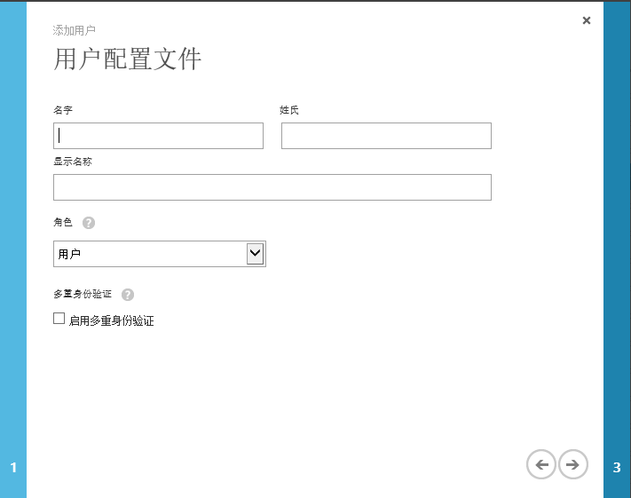
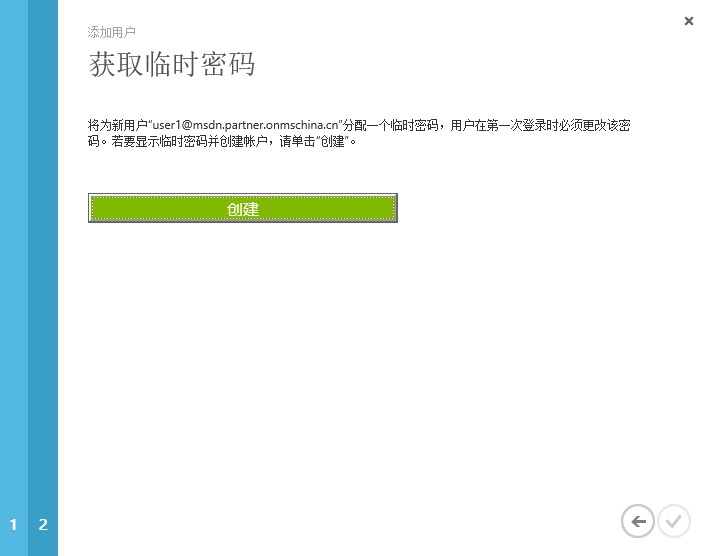
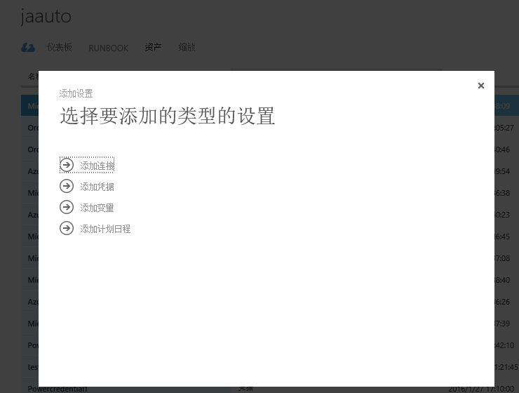
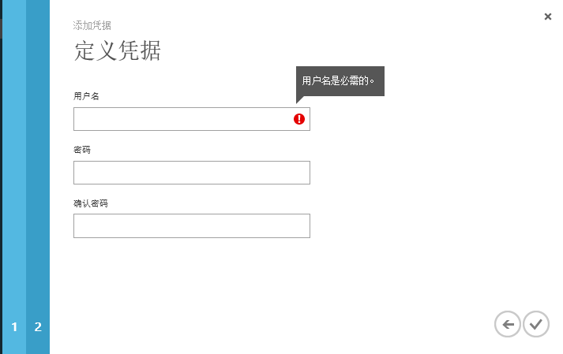
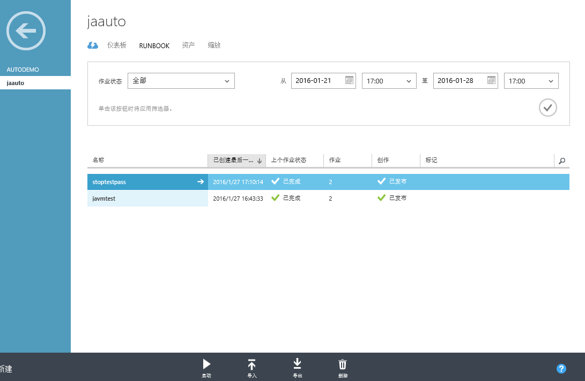

<properties 
	pageTitle="通过Azure Active Directory认证Azure 自动化服务" 
	description="如何在Azure自动化服务中使用Azure AD认证" 
	services="automation" 
	documentationCenter="" 
	authors=""
	manager="" 
	editor=""/>
<tags ms.service="automation" ms.date="" wacn.date="2/1/2016"/>

#通过Azure Active Directory认证Azure 自动化服务

关于Azure 自动化的详细概念请阅读[这篇文章](http://www.windowsazure.cn/home/features/automation/)。

Azure自动化是通过Windows PowserShell工作流（也成为Runbook）来处理Azure的资源和第三方应用的创建、部署、监视和维护工作的。在执行Runbook的时候自然需要认证是否拥有合理的身份来执行操作。本文介绍如何通过Azure Active Directory来授权。

首先去确认Azure订阅的目录名字（本文使用的订阅账户是"Microsoft"），可以在Azure门户网站设置里找到，如下图：

之后去Azure Active Directory里找到对应的目录，如下图：

点击进入"Microsoft"的Active Diectory，点击用户，然后添加用户

输入要创建的用户名：

输入名字、姓氏和显示名称：

**注意：**不要勾选启用多重身份验证，目前在Azure自动化服务中还不支持多重身份用户。

复制记录的密码，然后在Azure门户登录，第一次登陆需要修改密码。如果使用初始密码作为Runbook的凭证可能会导致操作失败。

然后进入自动化的资产，点击添加设置：

本文主要讨论使用PowerShell的方式来授权，所以我们选择“Windows PowerShell”凭据。

输入刚才创建的用户名和密码：

至此PowerShell的凭据已经创建完成，下面讨论如何来使用（本文主要是使用自动化服务实现开关虚拟机）。
首先我们进入Runbook

然后点击创作：

在创作的过程中使用下面的指令来实现授权，“Powercredential”为在定义凭据时使用的名称。

	$Cred = Get-AutomationPSCredential -Name "Powercredential"; 
    Add-AzureAccount -Credential $Cred -Environment AzureChinaCloud;
    Select-AzureSubscription -SubscriptionName "<subscription name>";  

