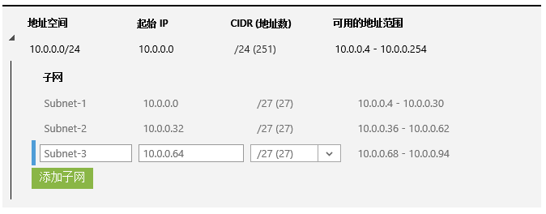
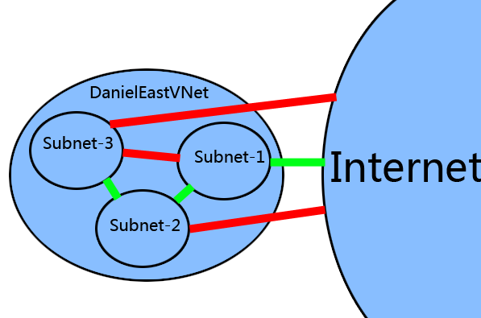
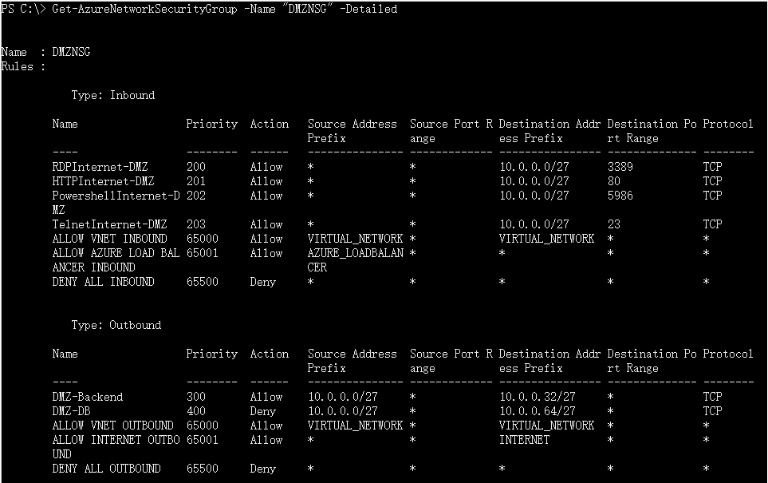
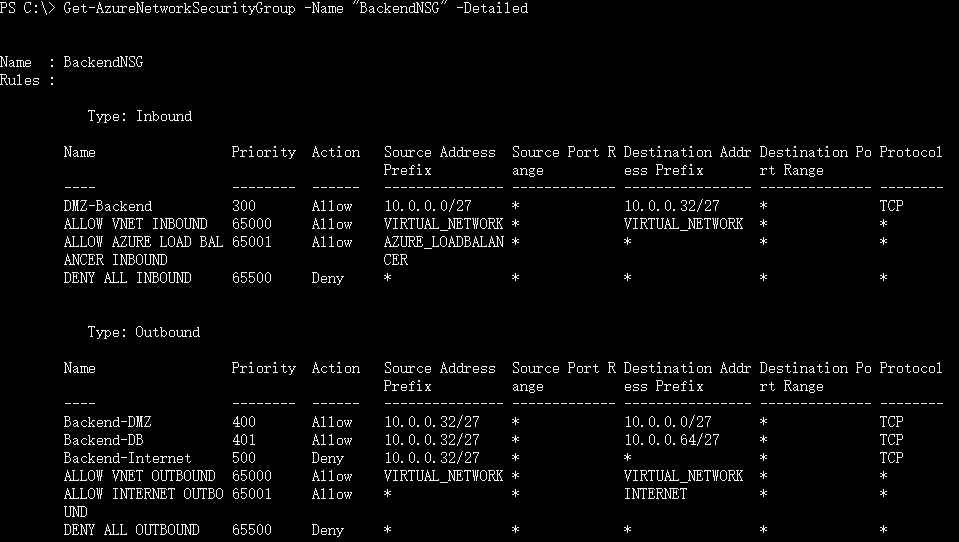
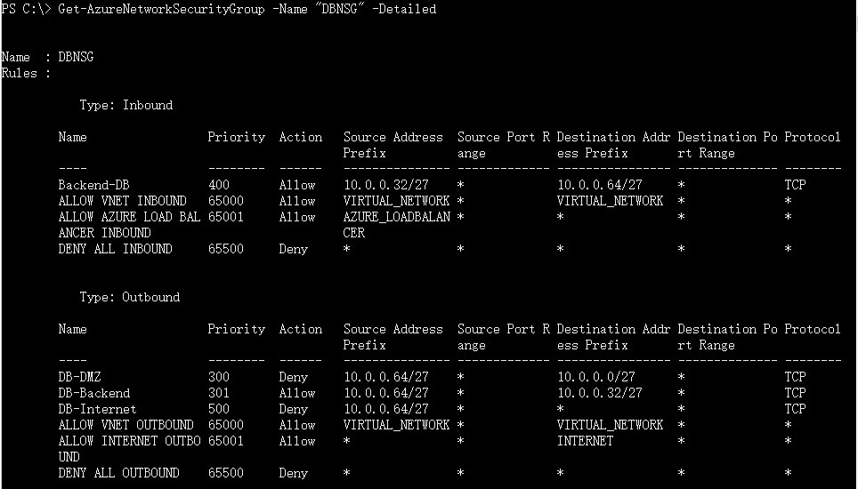

#使用NSG实现DMZ区域

###本文包含以下内容
- 详细操作
- PowerShell指令详解
- 关于NSG使用的一些说明
- 相关参考资料
 
##详细操作
 
1. 首先需要创建一个虚拟网络： 
   以下面的网络为例： 
   虚拟网络名称：DanielEastVNet 
   子网划分：
    
   每个子网部署1台虚拟机：
    
2. 接下来要实现下面的策略：
   Subnet-1面向公网，但是公网仅可以访问Subnet-1中虚拟机的80/5986/3389/23端口，从Subnet-1访问公网不受限。 
   Subnet-1可以与Subnet-2通信，Subnet-1不能与Subnet-3通信。 
   Subnet-2可以与Subnet-1和Subnet-3通信，Subnet-2屏蔽掉公网（进出流量都被屏蔽）。 
   Subnet-3可以与Subnet-2通信，不能与Subnet-1通信。Subnet-3屏蔽掉公网（进出流量都被屏蔽）。 
   大致的拓扑关系如下（红色表示不通，绿色标识连通）： 
    
 
3. 针对三个子网配置NSG的完整脚本如下：

		# Address Space 10.0.0.0/24 
		# Subnet-1 10.0.0.0/27 
		# Subnet-2 10.0.0.32/27 
		# Subnet-3 10.0.0.64/27 
		 
		$VNetName = "DanielEastVNet";
		$Subnet1Name = "Subnet-1";
		$Subnet2Name = "Subnet-2";
		$Subnet3Name = "Subnet-3";
		 
		$DMZNSG = New-AzureNetworkSecurityGroup -Name "DMZNSG" -Location "China East";
		$BackendNSG = New-AzureNetworkSecurityGroup -Name "BackendNSG" -Location "China East";
		$DBNSG = New-AzureNetworkSecurityGroup -Name "DBNSG" -Location "China East";
		 
		# set DMZ zone(Subnet-1) security rules
		$DMZNSG | Set-AzureNetworkSecurityRule -Name "RDPInternet-DMZ" -Type Inbound -Priority 200 -Action Allow -SourceAddressPrefix * -SourcePortRange * -DestinationAddressPrefix "10.0.0.0/27" -DestinationPortRange 3389 -Protocol TCP;
		$DMZNSG | Set-AzureNetworkSecurityRule -Name "RDPInternet-DMZ" -Type Inbound -Priority 200 -Action Allow -SourceAddressPrefix * -SourcePortRange * -DestinationAddressPrefix "10.0.0.0/27" -DestinationPortRange 22 -Protocol TCP;
		$DMZNSG | Set-AzureNetworkSecurityRule -Name "HTTPInternet-DMZ" -Type Inbound -Priority 201 -Action Allow -SourceAddressPrefix * -SourcePortRange * -DestinationAddressPrefix "10.0.0.0/27" -DestinationPortRange 80 -Protocol TCP;
		$DMZNSG | Set-AzureNetworkSecurityRule -Name "PowershellInternet-DMZ" -Type Inbound -Priority 202 -Action Allow -SourceAddressPrefix * -SourcePortRange * -DestinationAddressPrefix "10.0.0.0/27" -DestinationPortRange 5986 -Protocol TCP;
		$DMZNSG | Set-AzureNetworkSecurityRule -Name "TelnetInternet-DMZ" -Type Inbound -Priority 203 -Action Allow -SourceAddressPrefix * -SourcePortRange * -DestinationAddressPrefix "10.0.0.0/27" -DestinationPortRange 23 -Protocol TCP;
		$DMZNSG | Set-AzureNetworkSecurityRule -Name "DMZ-Backend" -Type Outbound -Priority 300 -Action Allow -SourceAddressPrefix "10.0.0.0/27" -SourcePortRange * -DestinationAddressPrefix "10.0.0.32/27" -DestinationPortRange * -Protocol TCP;
		$DMZNSG | Set-AzureNetworkSecurityRule -Name "DMZ-DB" -Type Outbound -Priority 400 -Action Deny -SourceAddressPrefix "10.0.0.0/27" -SourcePortRange * -DestinationAddressPrefix "10.0.0.64/27" -DestinationPortRange * -Protocol TCP;
		 
		# set Backend zone(Subnet-2) security rules
		$BackendNSG | Set-AzureNetworkSecurityRule -Name "DMZ-Backend" -Type Inbound -Priority 300 -Action Allow -SourceAddressPrefix "10.0.0.0/27" -SourcePortRange * -DestinationAddressPrefix "10.0.0.32/27" -DestinationPortRange * -Protocol TCP;
		$BackendNSG | Set-AzureNetworkSecurityRule -Name "Backend-DMZ" -Type Outbound -Priority 400 -Action Allow -SourceAddressPrefix "10.0.0.32/27" -SourcePortRange * -DestinationAddressPrefix "10.0.0.0/27" -DestinationPortRange * -Protocol TCP;
		$BackendNSG | Set-AzureNetworkSecurityRule -Name "Backend-DB" -Type Outbound -Priority 401 -Action Allow -SourceAddressPrefix "10.0.0.32/27" -SourcePortRange * -DestinationAddressPrefix "10.0.0.64/27" -DestinationPortRange * -Protocol TCP;
		$BackendNSG | Set-AzureNetworkSecurityRule -Name "Backend-Internet" -Type Outbound -Priority 500 -Action Deny -SourceAddressPrefix "10.0.0.32/27" -SourcePortRange * -DestinationAddressPrefix * -DestinationPortRange * -Protocol TCP;
		 
		# set DB zone(Subnet-3) security rules
		$DBNSG | Set-AzureNetworkSecurityRule -Name "DB-DMZ" -Type Outbound -Priority 300 -Action Deny -SourceAddressPrefix "10.0.0.64/27" -SourcePortRange * -DestinationAddressPrefix "10.0.0.0/27" -DestinationPortRange * -Protocol TCP;
		$DBNSG | Set-AzureNetworkSecurityRule -Name "DB-Backend" -Type Outbound -Priority 301 -Action Allow -SourceAddressPrefix "10.0.0.64/27" -SourcePortRange * -DestinationAddressPrefix "10.0.0.32/27" -DestinationPortRange * -Protocol TCP;
		$DBNSG | Set-AzureNetworkSecurityRule -Name "Backend-DB" -Type Inbound -Priority 400 -Action Allow -SourceAddressPrefix "10.0.0.32/27" -SourcePortRange * -DestinationAddressPrefix "10.0.0.64/27" -DestinationPortRange * -Protocol TCP;
		$DBNSG | Set-AzureNetworkSecurityRule -Name "DB-Internet" -Type Outbound -Priority 500 -Action Deny -SourceAddressPrefix "10.0.0.64/27" -SourcePortRange * -DestinationAddressPrefix * -DestinationPortRange * -Protocol TCP;
		 
		# apply the rules to associated subnets
		$DMZNSG | Set-AzureNetworkSecurityGroupToSubnet -VirtualNetworkName $VNetName -SubnetName $Subnet1Name;
		$BackendNSG | Set-AzureNetworkSecurityGroupToSubnet -VirtualNetworkName $VNetName -SubnetName $Subnet2Name;
		$DBNSG | Set-AzureNetworkSecurityGroupToSubnet -VirtualNetworkName $VNetName -SubnetName $Subnet3Name; 
 
 
4. 配置成功后，可以使用下面的命令查看每个AzureNetworkSecurityGroup的规则：

		Get-AzureNetworkSecurityGroup -Name "DMZNSG" -Detailed 
		Get-AzureNetworkSecurityGroup -Name "BackendNSG" -Detailed 
		Get-AzureNetworkSecurityGroup -Name "DBNSG" -Detailed 
 
     设置完成后规则列表如下：
 	 

 	 

 	  

##PowerShell指令详解
对下面这个命令的一些参数做一下简单说明：

		Set-AzureNetworkSecurityRule -Name "DB-DMZ" -Type Outbound -Priority 300 -Action Deny -SourceAddressPrefix "10.0.0.64/27" -SourcePortRange * -DestinationAddressPrefix "10.0.0.0/27" -DestinationPortRange * -Protocol TCP;

**Name**：指定过滤规则的名称 
**Type**：Inbound和Outbound，指相对VM或者Subnet而言是向内还是向外的流量 
**Priority**：规则的优先级，值越小越先匹配 
**Action**：Allow和Deny，指如果规则匹配，那么允许或者拒绝该流量 
**SourceAddressPrefix和DestinationAddressPrefix**：访问的源和目的IP段，通常有下面几种取值： 
**CIDR地址**：例如10.0.0.0/27这种子网网段或者公网IP段都可以 
\*：表示任何IP 
**VIRTUAL_NETWORK**：表示所在虚拟网络内的IP地址 
**INTERNET**：公网IP地址 
**ZURE_LOADBALANCER**：Azure的负载均衡转发过来的流量 
**SourcePortRange和DestinationPortRange**：源和目的端口，通常为具体的端口号或者*（代表任何端口） 
**Protocol**：TCP或者UDP协议

##关于NSG使用的一些说明
1.	如果NSG应用到虚拟机上，那么必须删除该虚拟机所有的ACL，即对于虚拟机ACL和NSG不能并存。
2.	如果NSG应用到虚拟机所在的子网上，那么仍然可以为虚拟机配置ACL。
3.	配置了NSG后，虚拟网络中如果设置了规则的线路就无法ping通了（因为规则只允许TCP或者UDP协议），例如上面的例子中，Subnet-1和Subnet-2中的虚拟机可以使用Psping来测试连通性，ping命令会超时。
4.	当设置规则的时候，对于虚拟机或者虚拟网络来说，指定开放或者屏蔽端口的时候，需要使用内网端口，不存在NAT转换。
 
##参考文档

- [什么事网络安全组](http://www.windowsazure.cn/documentation/articles/virtual-networks-nsg)
- [如何在 PowerShell 中创建 NSG（经典）](http://wacn-ppe.chinacloudsites.cn/documentation/articles/virtual-networks-create-nsg-classic-ps)

