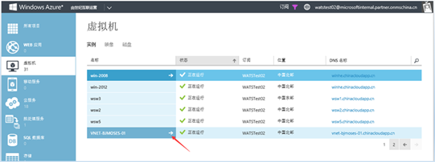
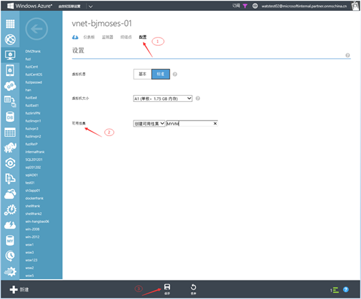
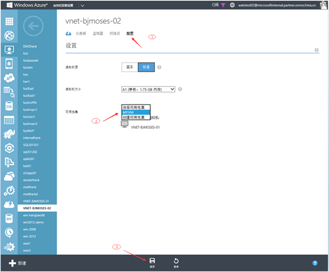
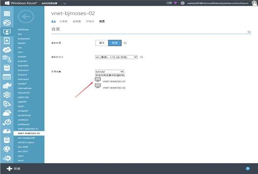

<properties 
	pageTitle="将虚拟机添加到可用性集中" 
	description="本页介绍如何将虚拟机添加到可用性集中。" 
	services="vm" 
	documentationCenter="" 
	authors=""
	manager="" 
	editor=""/>
<tags ms.service="vm" ms.date="" wacn.date="12/18/2015"/>

#将虚拟机添加到可用性集中

###本文包含以下内容

- [相关概念](#concept)
- [详细步骤](#detail)
- [注意事项](#note)
 
## 相关概念

**可用性集**：可用性集可以保证高可用性，在应用程序中使用多台虚拟机可以确保在出现本地网络故障、本地磁盘硬件故障以及平台可能需要的任何计划内停机时，应用程序仍然可用。每个可用性集至少包含两台虚拟机。

## 详细步骤

1. 虚拟机-(本例)VNET-BJMOSES-01

	 
 
2. 配置-可用性集-保存（在“可用性集”中，选择“创建可用性集”，在“可用性集名称”中，输入可用性集的名称，单击保存创建可用性集）

	 
 
3. 第二台VM-配置-可用性集（本例：MYVM）-保存

	
	 
 
4. 从新虚拟机的仪表板中，单击“配置”，您会看到该虚拟机现在是新可用性集的一个成员

	 
 
## 注意事项

-	要放入相同可用性集的虚拟机必须属于相同的云服务。
-	虚拟机可能必须重新启动，以完成将其添加到可用性集的操作。